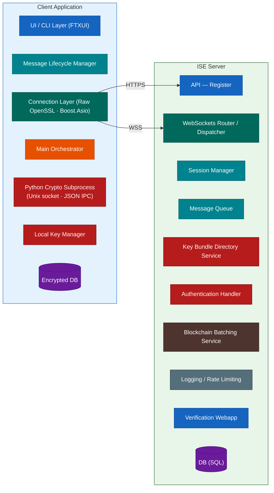
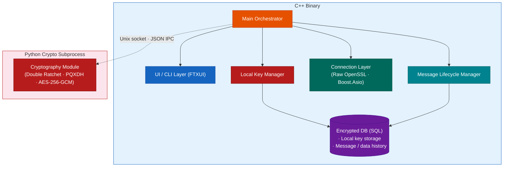
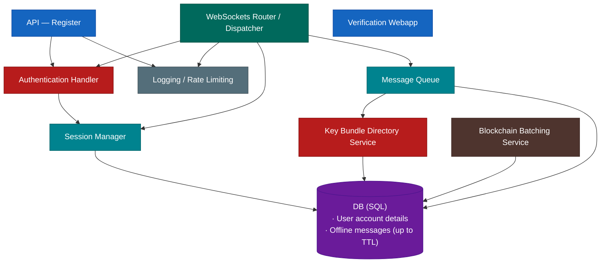

# System Architecture

## System Overview

---

## Client Application — Internals

---

## ISE Server — Internals

---

## Component Legend

| Color | Layer | Components |
|-------|-------|-----------|
| Blue | Interface / Entry | UI/CLI Layer, API, Verification Webapp |
| Orange | Orchestration | Main Orchestrator |
| Teal | Transport | Connection Layer, WebSockets Router |
| Cyan | Messaging & State | Message Lifecycle Manager, Session Manager, Message Queue |
| Red | Security & Keys | Python Crypto Subprocess (separate process, Unix socket IPC), Local Key Manager, Auth Handler, Key Bundle Directory |
| Brown | Blockchain | Blockchain Batching Service |
| Grey | Infrastructure | Logging / Rate Limiting |
| Purple | Storage | Encrypted DB, DB (SQL) |
