# Helper Daemons

Background processes running on the ISE Server.

```mermaid
flowchart TD
    classDef trigger  fill:#37474F,stroke:#263238,color:#fff
    classDef process  fill:#1565C0,stroke:#0D47A1,color:#fff
    classDef delete   fill:#B71C1C,stroke:#7F0000,color:#fff
    classDef anchor   fill:#4E342E,stroke:#3E2723,color:#fff
    classDef done     fill:#2E7D32,stroke:#1B5E20,color:#fff

    subgraph TTL["Daemon 1 — TTL Cleanup  (every 24 hours)"]
        T1([Scheduler]):::trigger --> T2["Scan offline message queue"]:::process
        T2 --> T3["Identify messages past TTL deadline"]:::process
        T3 --> T4["Hard-delete expired records"]:::delete
        T4 --> T5([Done]):::done
    end

    subgraph HASH["Daemon 2 — Off-chain Hashing  (every X minutes)"]
        H1([Scheduler]):::trigger --> H2["Find messages past edit / delete window"]:::process
        H2 --> H3["Compute message hashes off-chain"]:::process
        H3 --> H4["Anchor batched hashes to main blockchain"]:::anchor
        H4 --> H5([Done]):::done
    end

    style TTL  fill:#FFF8E1,stroke:#F57F17
    style HASH fill:#EDE7F6,stroke:#6A1B9A
```

| Daemon | Runs | Purpose |
|--------|------|---------|
| TTL Cleanup | Every 24 hours | Purge expired offline messages from the DB |
| Off-chain Hashing | Every X minutes | Hash finalized messages and anchor to blockchain |
