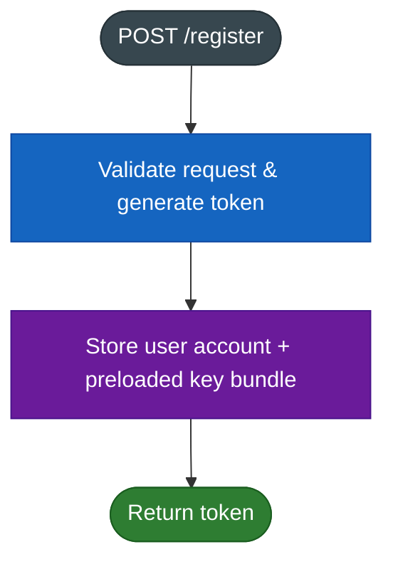
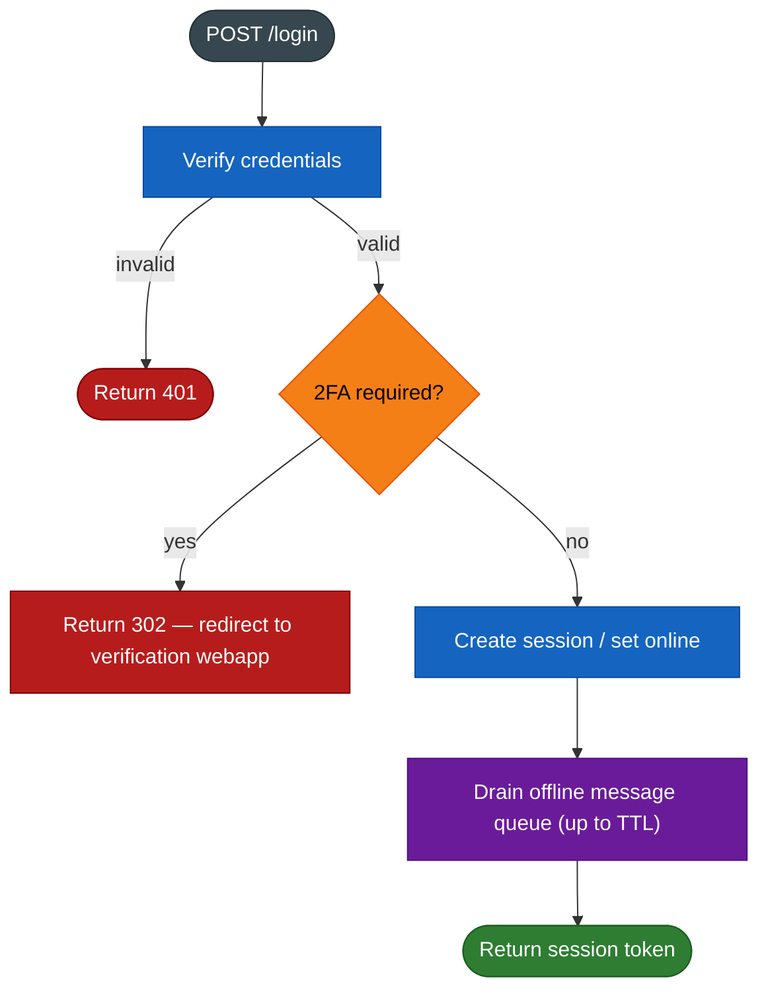
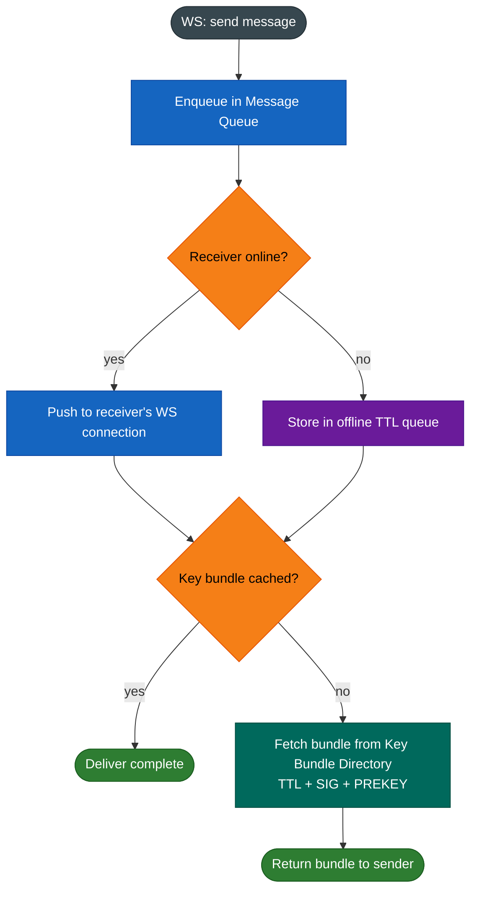
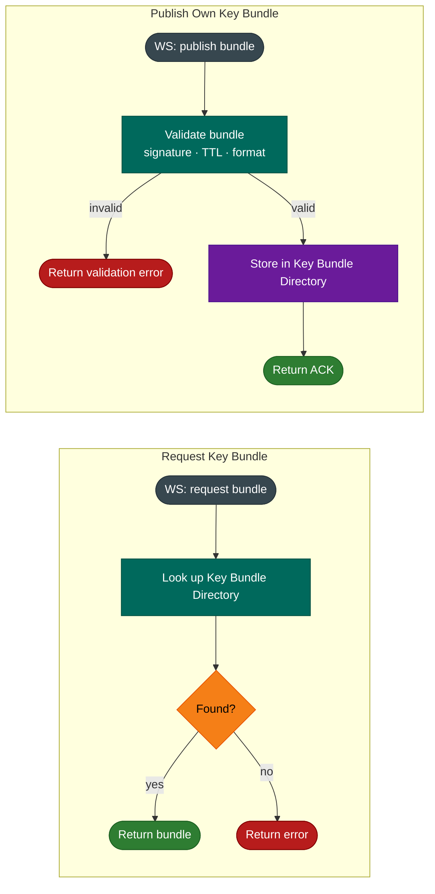
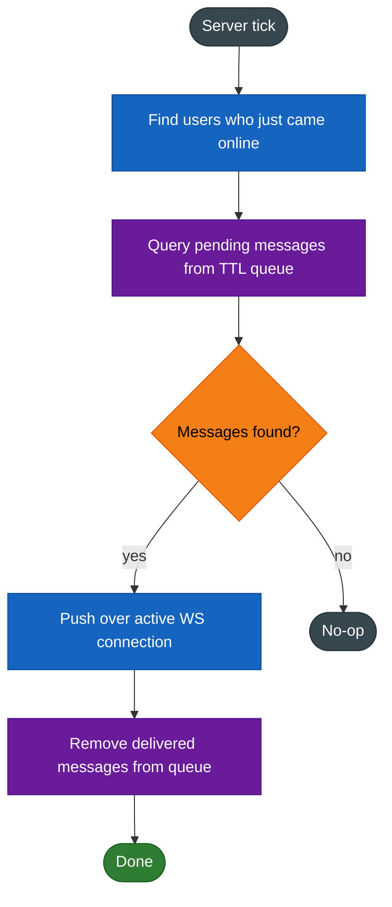

# Server Flows

> **Color key:** dark grey = start/end · blue = process · amber = decision · green = success · red = error · purple = storage · teal = key/security op

---

## 1. Register

---

## 2. Login

---

## 3. WS — Send Message

---

## 4. WS — Key Bundle Operations

---

## 5. WS — Timeline Tick (Server-side Push)

